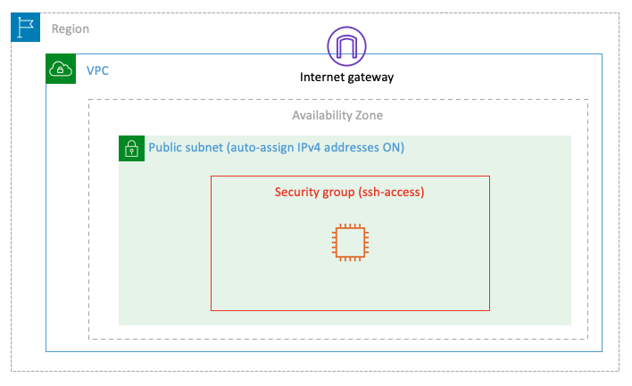

# Lab-001

## A Single Linux EC2 Instance

Difficulty Level: 1

Creation Date: June 8, 2020

Original Author(s): [Thyago Mota](https://github.com/thyagomota)

Contributor(s): [João Marcelo](https://github.com/jmhal)

## Goal
The goal of this lab is to launch a Linux EC2 instance in a public subnet accessible over the Internet via SSH.

## Architecture Diagram


## Overview

In order to achieve the goal of this lab, you will have to go through the following steps:

1. Choose the operating system by selecting the [Amazon Machine Image (AMI)](https://docs.aws.amazon.com/AWSEC2/latest/UserGuide/AMIs.html).
2. Define the virtual hardware configuration by choosing an [instance type](https://docs.aws.amazon.com/AWSEC2/latest/UserGuide/instance-types.html).
3. Review the network settings.
4. Review the storage settings.
5. Create tags (optional).
6. Configure the [security group](https://docs.aws.amazon.com/vpc/latest/userguide/VPC_SecurityGroups.html) rules (firewall).
7. Launch the instance (choosing or creating an [EC2 key pair](https://docs.aws.amazon.com/AWSEC2/latest/UserGuide/ec2-key-pairs.html)).

Let's begin!!!

### Step 1 - Choose the AMI
In the EC2 service menu, click on *Launch instance* and then select *Amazon Linux 2 AMI*.

### Step 2 - Define the Instance Type
You can use the suggested free-tier eligible instance type.

### Step 3 - Network Settings
Make sure you select the public default subnet and that the *Auto-assign Public IP* setting is enabled for that subnet.

### Step 4 - Storage Settings
You can accept the default settings which creates an EBS root volume.

### Step 5 - Tags
You can skip this step.

### Step 6 - Security Group
Create a new security group named *ssh-access* with a rule that allows SSH from anywhere (or choose *My IP* if you prefer).

### Step 7 - Launch Instance
 For the key-pair you can create a new key pair (name it lab-001). Download the key pair to your computer (the file will be named *lab-001.pem*).

## Test and Validation
1. Once your instance is up and running, click on *Connect* and copy the example ssh command-line.
2. Open a terminal window and move to the folder where you saved the downloaded key file *lab-001.pem*.
3. Change the permissions of the key file:

``` bash
chmod 600 lab-001.pem
```

4. Paste and run the ssh command.
5. You should be able to log into your instance.
