# Lab-001

## A Single EC2 Instance

Difficulty Level: 1

Creation Date: June 8, 2020

Original Author(s): [Thyago Mota](https://github.com/thyagomota)

Contributor(s): [João Marcelo](https://github.com/jmhal)

## Goal
The goal of this lab is to launch a single EC2 instance in a public subnet accessible over the Internet via SSH.

## Architecture Diagram


## Overview

In order to achieve the goal of this lab, you will have to go through the following steps:

1. Choose the operating system by selecting the [Amazon Machine Image (AMI)](https://docs.aws.amazon.com/AWSEC2/latest/UserGuide/AMIs.html).
2. Define the virtual hardware configuration by choosing an [Instance Type](https://docs.aws.amazon.com/AWSEC2/latest/UserGuide/instance-types.html).
3. Review the network settings.
4. Review the storage settings.
5. Create tags (optional).
6. Configure the [Security Group](https://docs.aws.amazon.com/vpc/latest/userguide/VPC_SecurityGroups.html) rules (firewall).
7. Launch the instance (choosing or creating an [EC2 key pair](https://docs.aws.amazon.com/AWSEC2/latest/UserGuide/ec2-key-pairs.html)).

Let's begin!!! Go to [AWS Console](https://console.aws.amazon.com/) and login with your credentials. Click on Services at the top left, then choose EC2 in the Compute section.

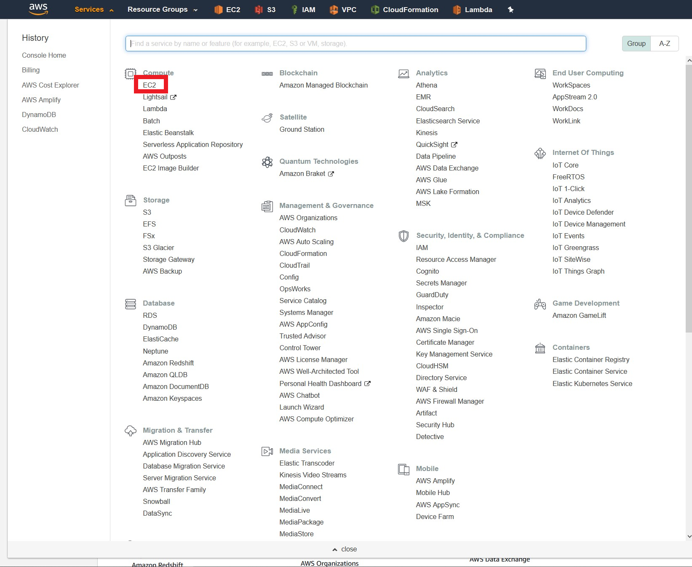

### Step 1 - Choose the AMI
In the EC2 service menu, click on *Launch instance* and select *Launch Instance*.  

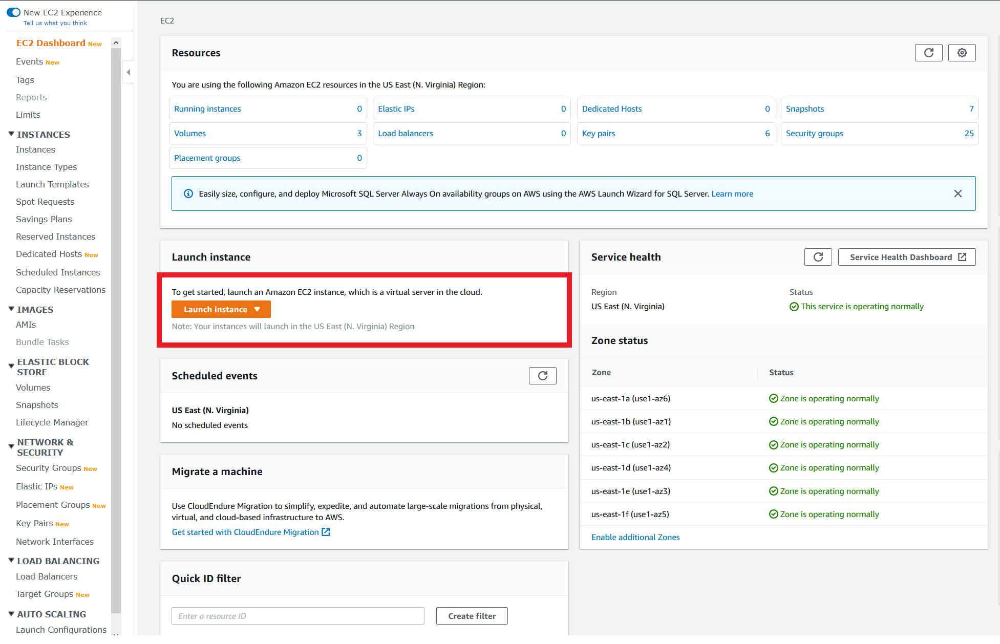

Select *Amazon Linux 2 AMI*. An AMI is a template that contains the software configuration (operating system, application server, and applications) required to launch your instance. In this first lab, we will stick to the x86 architecture.

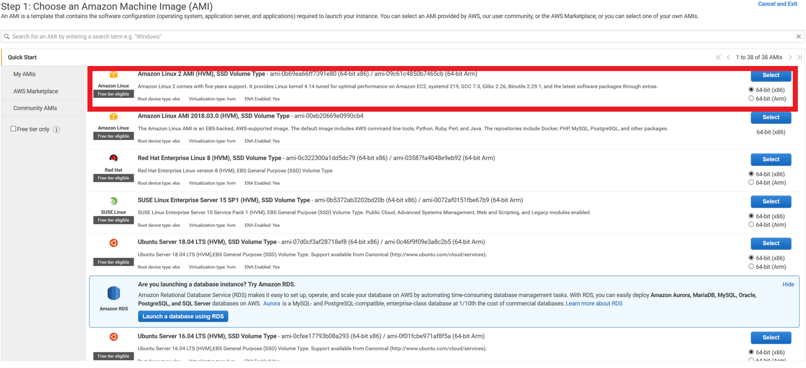

### Step 2 - Define the Instance Type
The instance type defines the CPU and memory capacity. It also specifies the storage architecture the the instance will suppport, along with network perfomance available. You can use the suggested free-tier eligible instance type, and then go on to _Next: Configure Instance Details_.

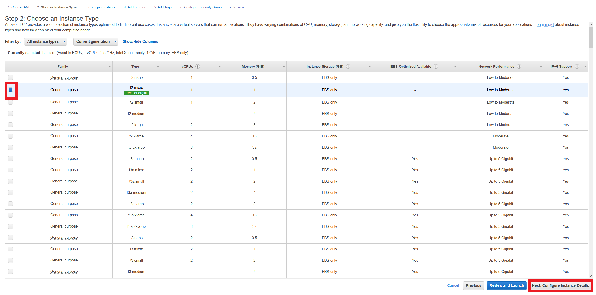

### Step 3 - Network Settings
Make sure you select the public default subnet and that the *Auto-assign Public IP* setting is enabled for that subnet. You may leave all the other settings with their default values.

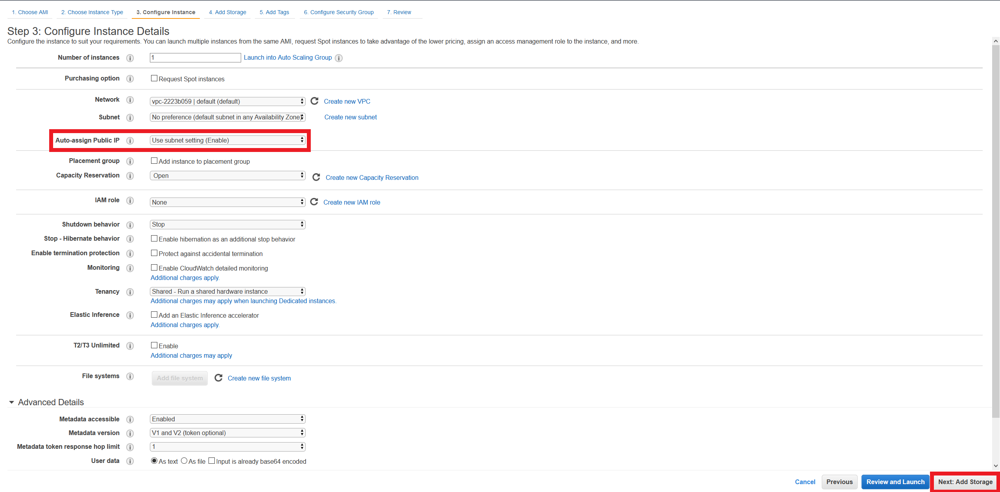

Go on to _Next: Add Storage_.

### Step 4 - Storage Settings
You can accept the default settings which creates an EBS root volume.

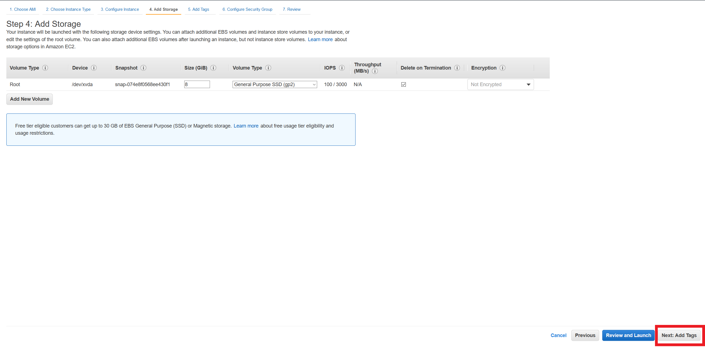

Go on to _Next: Add Tags_.

### Step 5 - Tags
_Tags_ is a way to add textual metadata to AWS Resources to help you manage your cloud environment. For now, you can skip this step.

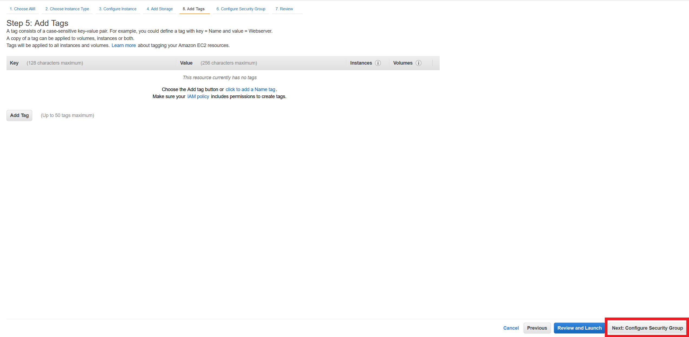

Go on to _Next: Configure Security Group_.

### Step 6 - Security Group
The _Security Group_ is a firewall for the instance. Create a new security group named *ssh-access* with a rule that allows SSH from anywhere (or choose *My IP* if you prefer).

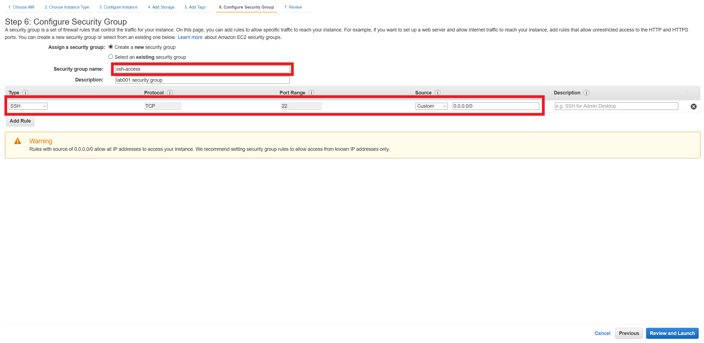

Go on to _Review and Launch_.

### Step 7 - Launch Instance
You can review all the settings until this step in the next screen.


If everything is Ok, go on to _Launch_. In the new windows, for the key-pair you can create a new key pair (name it lab-001). Download the key pair to your computer (the file will be named *lab-001.pem*).

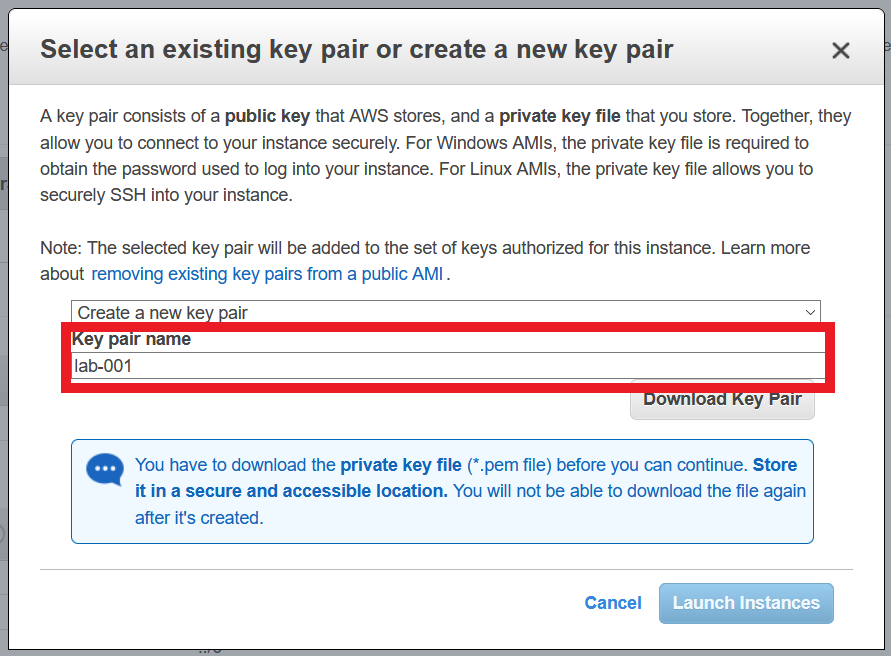

You will be forwarded to a new screen with the launch status.

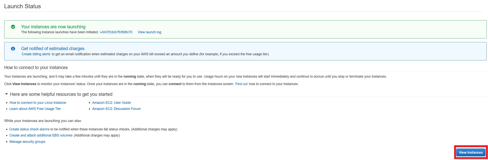

Go on to _View Instances_ to return to the EC2 Console. There you will a list of existing instances and the new instance you just created.

## Testint your Instance.

Once your instance is up and running, select it on the EC2 console and click on *Connect*.

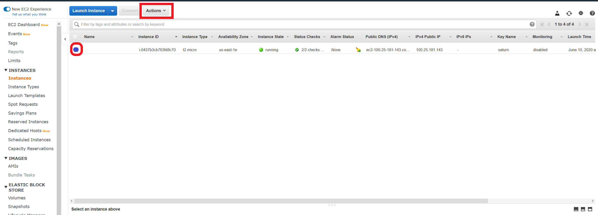

From the new window, copy the example ssh command-line. It will have the following format:

``` bash
$ ssh -i "lab-001.pem" ec2-user@ec2-100-25-181-143.compute-1.amazonaws.com
```

The _ec2-user_ is the default user name in Amazon Linux AMIs. The hostname _ec2-100-25-181-143.compute-1.amazonaws.com_ is the DNS name for your instance that AWS automatically defines. Open a terminal window and move to the folder where you saved the downloaded key file *lab-001.pem*. Change the permissions of the key file:

``` bash
$ chmod 400 lab-001.pem
```
Paste and run the ssh command. You should be able to log into your instance. If you are a Windows user, you can also use Putty to connect. Follow this [link](https://docs.aws.amazon.com/AWSEC2/latest/UserGuide/putty.html?icmpid=docs_ec2_console) for instructions.
