# Lab-002

## A Single EC2 Instance in a Private Subnet + Bastion Host

Difficulty Level: 1

Creation Date: June 9, 2020

Original Author(s): [Thyago Mota](https://github.com/thyagomota)

Contributor(s): [João Marcelo](https://github.com/jmhal)

## Goal
The goal of this lab is to demonstrate how to access an EC2 instance launched in a private subnet using a bastion host. 

## Architecture Diagram
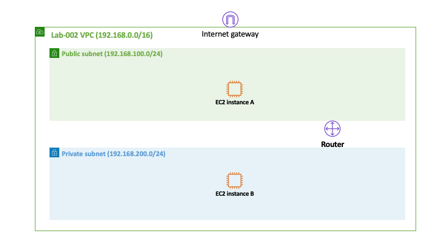

## Overview

In order to achieve the goal of this lab, you will have to go through the following steps:

### Step 1 - Create VPC
Create a new VPC with the *Name tag* lab-002 and the *IPv4 CIDR block* 192.168.0.0/16.

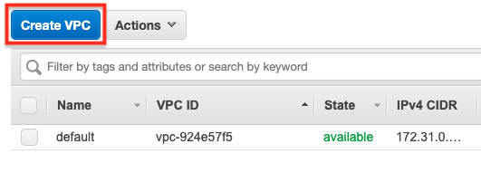
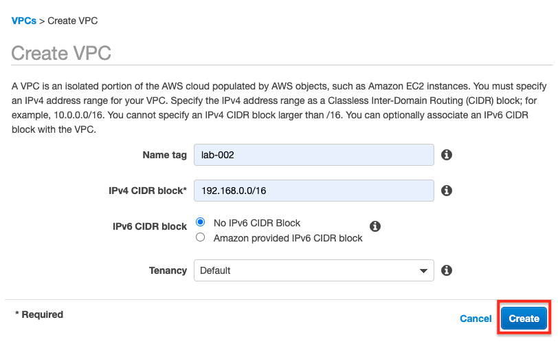
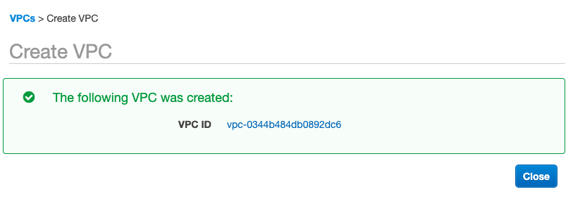

### Step 2 - Create an Internet Gateway
Create an [Internet gateway](https://docs.aws.amazon.com/vpc/latest/userguide/VPC_Internet_Gateway.html) with the *Name tag* lab-002 and attach it to lab-002 VPC.

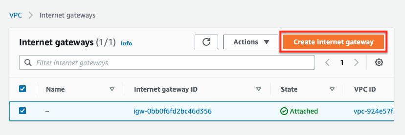
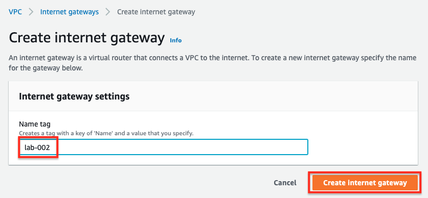
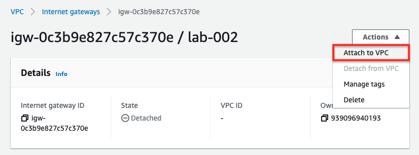
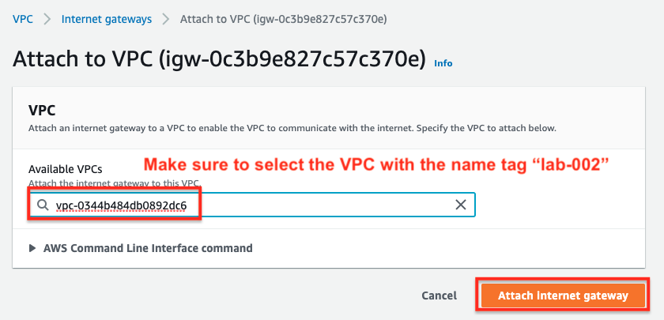
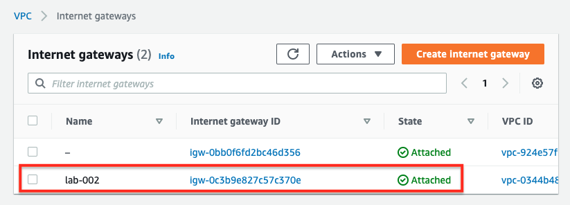

### Step 3 - Create the Public Subnet
Create a public subnet on lab-002 VPC with the *Name tag* public and *IPv4 CIDR block* 192.168.100.0/24.  


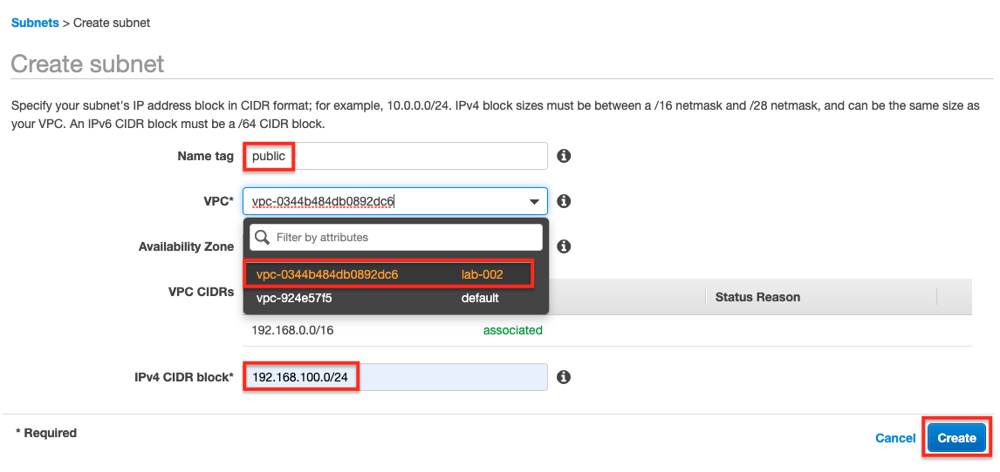
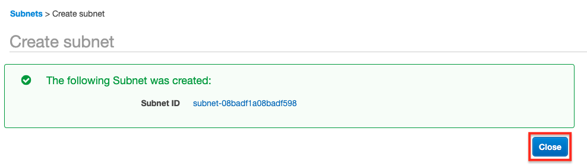

### Step 4 - Enable Auto-assign IPv4
Enable *Auto-assign IPv4* in the newly created public subnet.

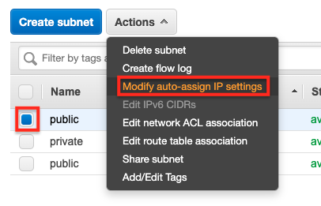
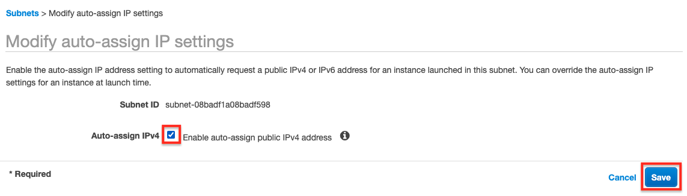

### Step 5 - Create a Route Table
Create a new route table with the *Name tag* public and with a default route to the internet gateway created in step 2.

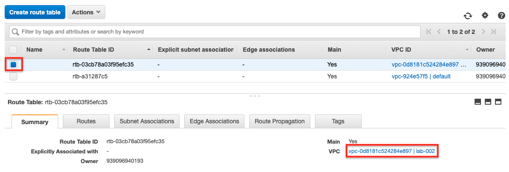
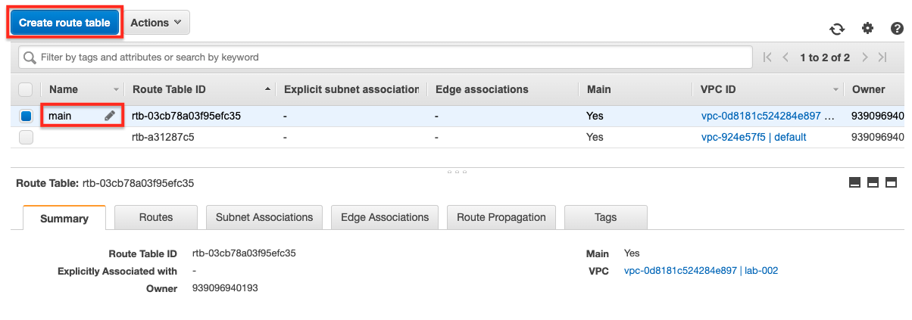
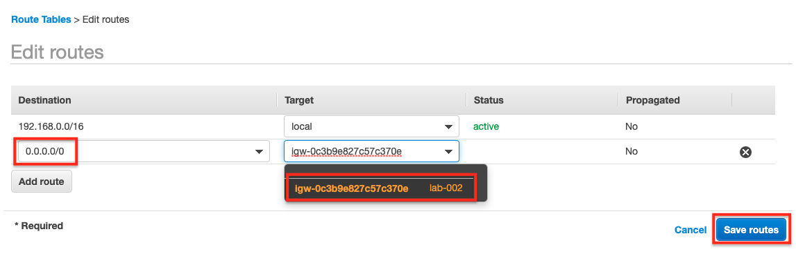
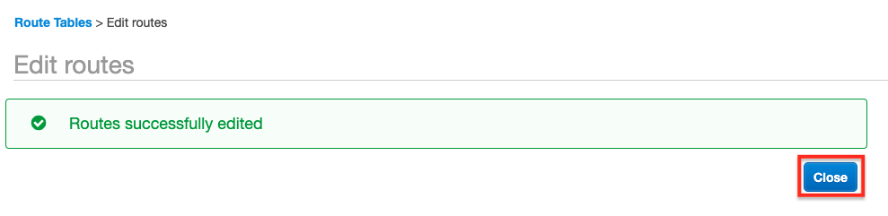
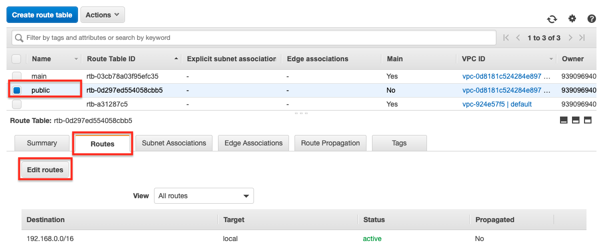
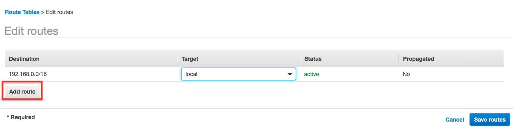

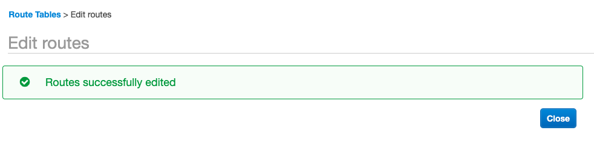

### Step 6 - Associate the Route Table to the Public Subnet
Associate the newly created route table to the public subnet.

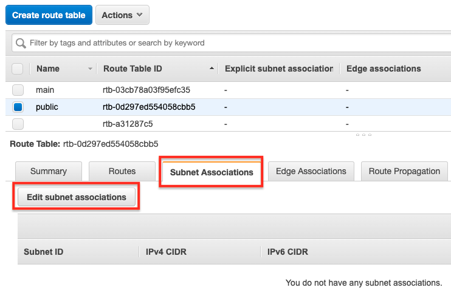
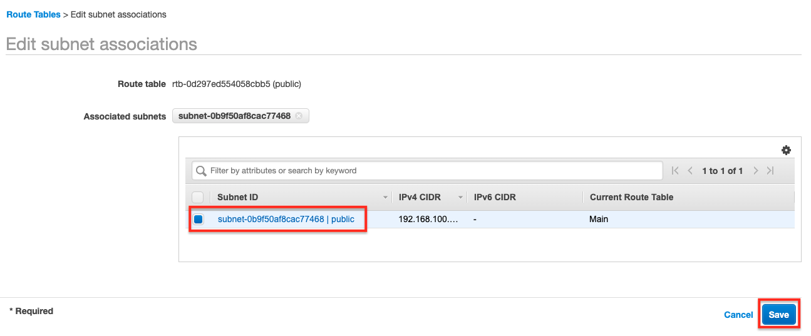

### Step 7 - Create the Private Subnet
Create a private subnet on lab-002 VPC with the *Name tag* private and the *IPv4 CIDR block* 192.168.200.0/24.

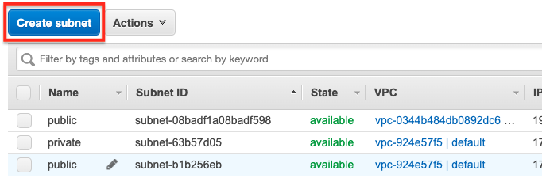

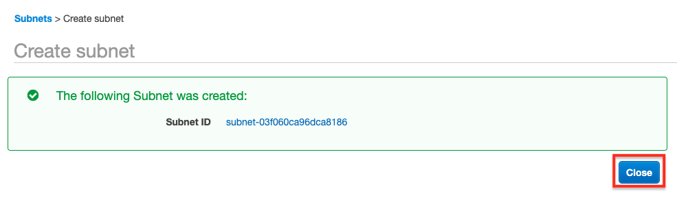

### Step 8 - Launch the EC2 Instances
Launch two EC2 instances using the procedure described in [lab-001](../lab-001); make sure that each subnet has one of the instances.

Note that the EC2 instance that you will create in the public subnet (labeled as A in the diagram) is necessary so you can later connect to the EC2 instance in the private subnet (labeled as B in the diagram).  EC2 A is normally called *bastion host* or *jump host*.  

## Test and Validation
1. First add the EC2 key pair into your local ssh authentication agent using:

```
ssh-add -K lab-002.pem (macos)
ssh-add -c lab-002.pem (linux)
```
Got this error: "Permission Denied (publickey,gssapi-keyex,gssapi-with-mic)" ?
Refer: https://phoenixnap.com/kb/ssh-permission-denied-publickey

2. Then connect to the EC2 instance A but with ssh agent forwarding enabled:  

```
ssh -A ec2-user@<public-IP of A>
```
3. Finally, from EC2 instance A ssh to the EC2 instance B using its private IP address:

```
ssh <private-IP of B>
```
