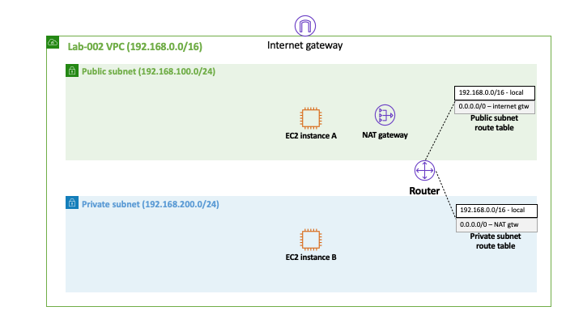

# Lab-003

## An EC2 Instance in a Private Subnet with Internet Access

Difficulty Level: 1

Creation Date: June 9, 2020

Original Author(s): [Thyago Mota](https://github.com/thyagomota)

Contributor(s): [João Marcelo](https://github.com/jmhal)

## Goal
This lab illustrates how an EC2 instance running in a *private* subnet can be configure to access the internet with the help of a service called [Nat gateway](https://docs.aws.amazon.com/vpc/latest/userguide/vpc-nat-gateway.html).

## Architecture Diagram


## Overview

In order to achieve the goal of this lab, you will have to go through the following steps:

1. Repeat all of the steps described in [lab-002](../lab-002).
2.


## Test
1. First add the EC2 key pair into your local ssh authentication agent using:

```
ssh-add -K lab-002.pem (macos)
ssh-add -c lab-002.pem (linux)
```

2. Then connect to the EC2 instance A but with ssh agent forwarding enabled:  

```
ssh -A ec2-user@<public-IP of A>
```
3. Finally, from EC2 instance A ssh to the EC2 instance B using its private IP address:

```
ssh <private-IP of B>
```
