# Lab-003

## A Single EC2 Instance in a Private Subnet + Bastion Host + NAT Gateway

Difficulty Level: 1

Creation Date: June 9, 2020

Original Author(s): [Thyago Mota](https://github.com/thyagomota)

Contributor(s): [João Marcelo](https://github.com/jmhal)

## Goal
This lab illustrates how an EC2 instance running in a *private* subnet can be configured to access the internet with the help of a service called [Nat gateway](https://docs.aws.amazon.com/vpc/latest/userguide/vpc-nat-gateway.html).

## Architecture Diagram


## Overview

In order to achieve the goal of this lab, you will have to go through the following steps:

### Step 1 - Run Lab-002
Repeat all of the steps described in [lab-002](../lab-002), making sure that any reference to lab-002 are replaced by lab-003.

### Step 2 - Create a NAT Gateway
Create a [NAT gateway](https://docs.aws.amazon.com/vpc/latest/userguide/vpc-nat-gateway.html) in the public subnet. Note that an elastic public IP must be allocated before a NAT gateway can be created.  

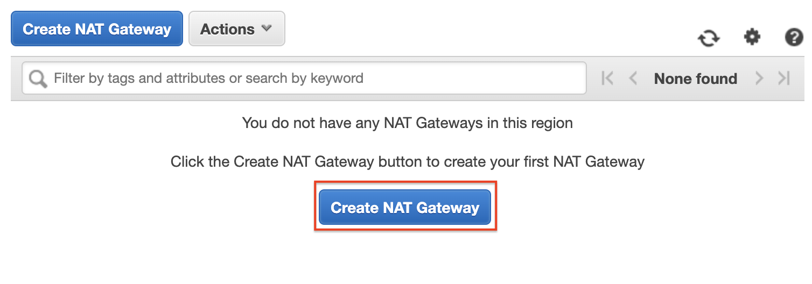
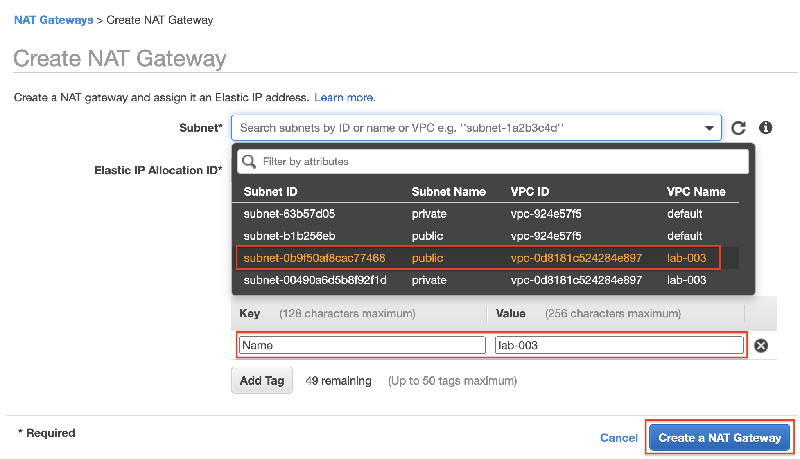
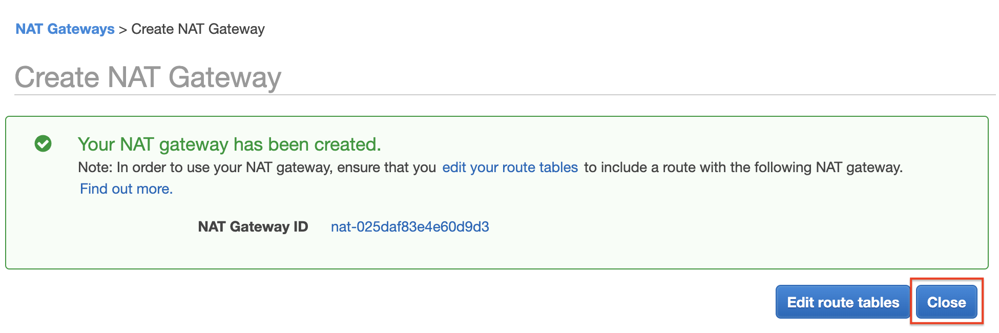

### Step 3 - Create a Route Table
Create a new route table with the *Name tag* private and with a default route to the NAT gateway created in step 2.

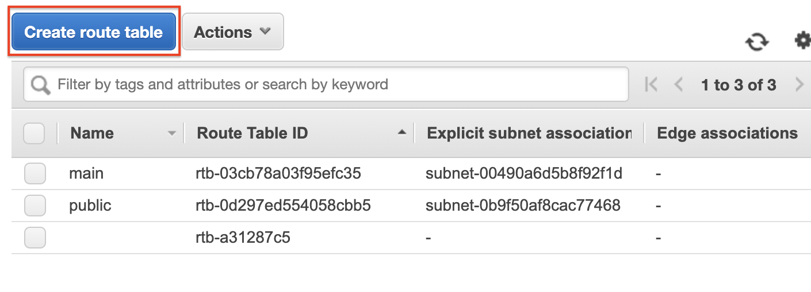
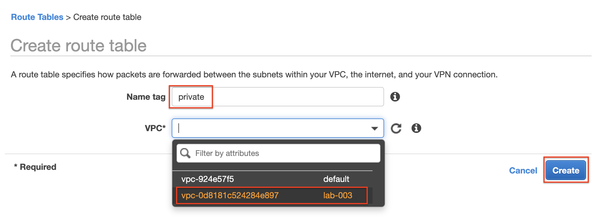
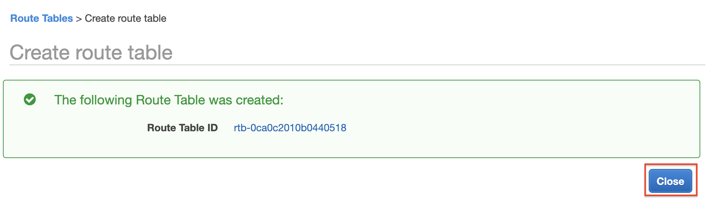
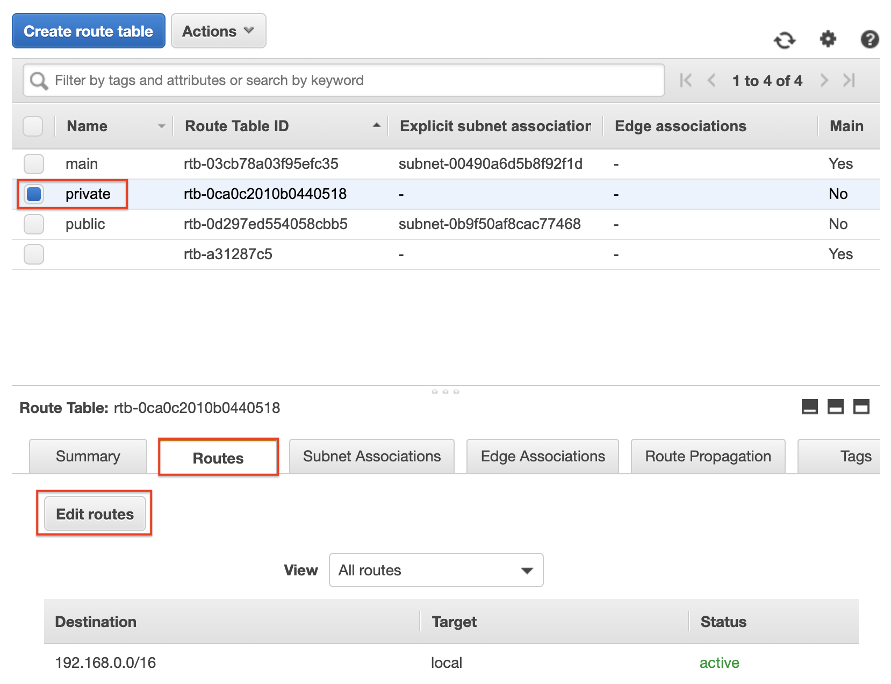

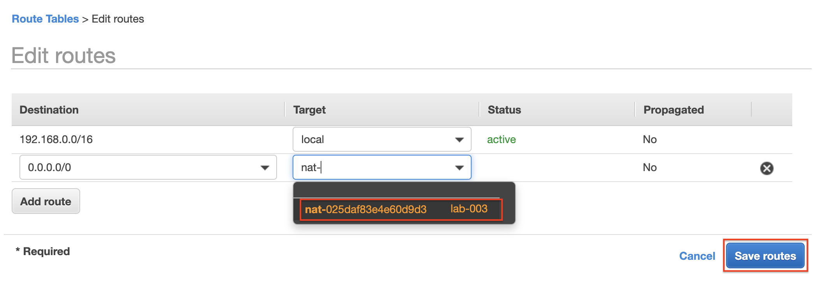
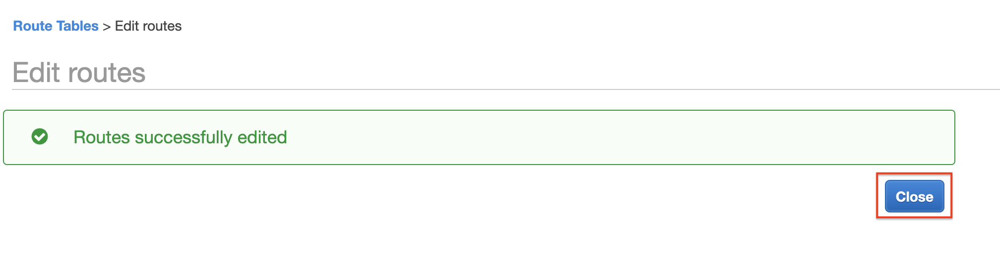

### Step 4 - Associate the Route Table to the Private Subnet
Associate the newly created route table to the private subnet.

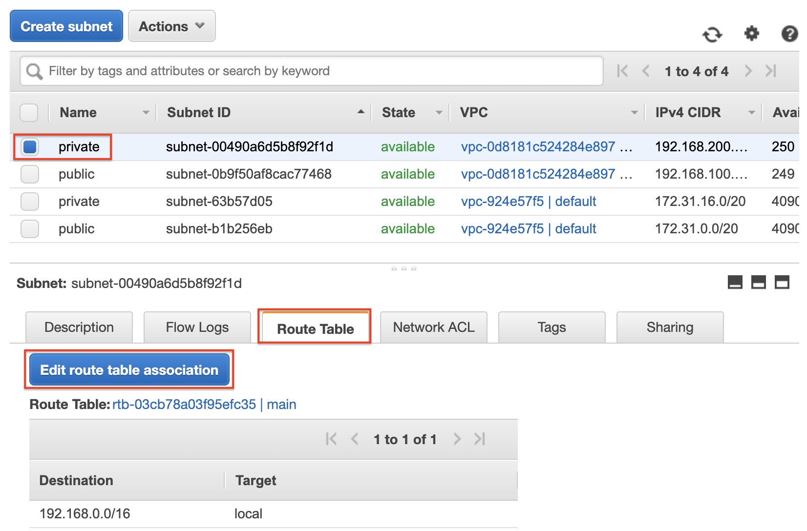
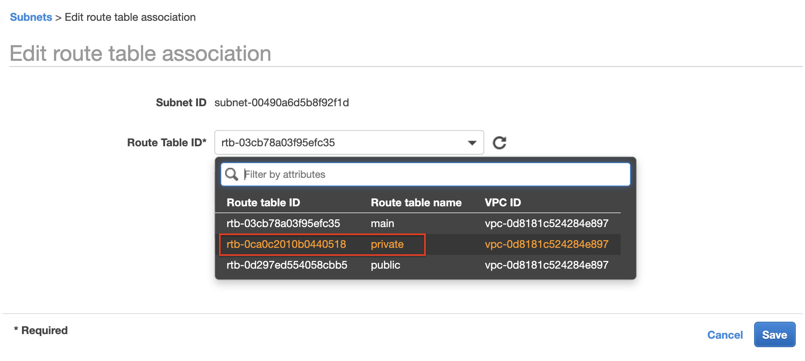
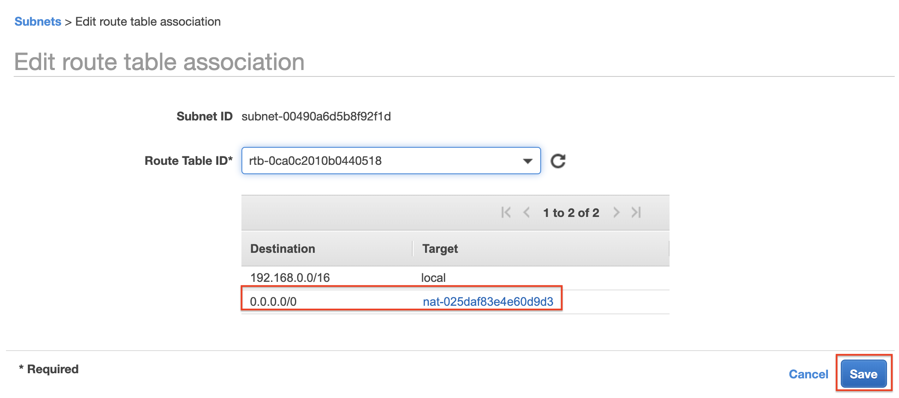
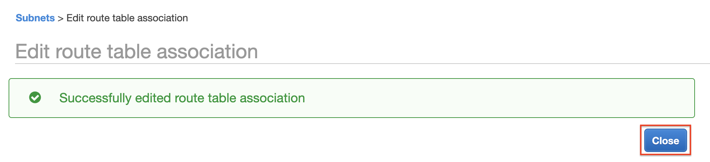


## Test and Validation
To validate this lab you need to access the EC2 instance in the private subnet (labeled as B) and from there try to access the internet, for example:

```
curl www.google.com
```
