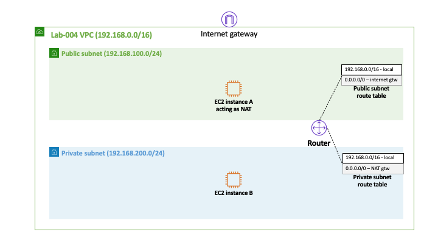

# Lab-003

## An EC2 Instance in a Private Subnet with Internet Access

Difficulty Level: 1

Creation Date: June 9, 2020

Original Author(s): [Thyago Mota](https://github.com/thyagomota)

Contributor(s): [João Marcelo](https://github.com/jmhal)

## Goal
This lab is similar to [lab-003](../lab-003) but instead of using a *Nat gateway* you are asked to use a *Nat instance*.

## Architecture Diagram


## Overview

Repeat all of the steps described in [lab-003](../lab-003) except the ones that describe how to create a *Nat gateway*.  Also, when you create the EC2 instance in the public subnet (the one labeled B), make sure you use an AMI with pre-installed NAT software.

### Step 1 -


## Test
1. First add the EC2 key pair into your local ssh authentication agent using:

```
ssh-add -K lab-002.pem (macos)
ssh-add -c lab-002.pem (linux)
```

2. Then connect to the EC2 instance A but with ssh agent forwarding enabled:  

```
ssh -A ec2-user@<public-IP of A>
```
3. Finally, from EC2 instance A ssh to the EC2 instance B using its private IP address:

```
ssh <private-IP of B>
```
