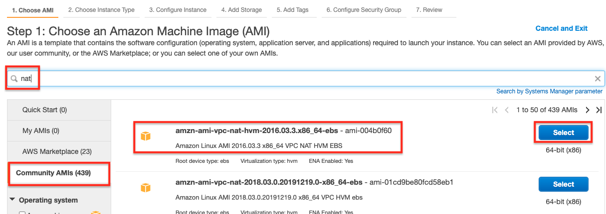
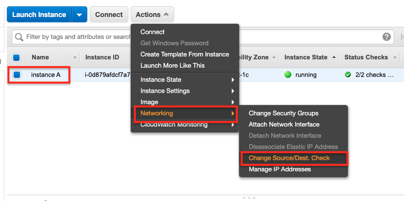
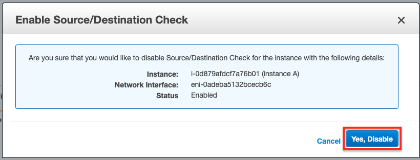

# Lab-004

## A Single EC2 Instance in a Private Subnet + Bastion Host + Nat Instance

Difficulty Level: 1

Creation Date: June 10, 2020

Original Author(s): [Thyago Mota](https://github.com/thyagomota)

Contributor(s): [João Marcelo](https://github.com/jmhal)

## Goal
This lab is similar to [lab-003](../lab-003) but instead of using a *Nat gateway* you are asked to use a [Nat instance](https://docs.aws.amazon.com/vpc/latest/userguide/VPC_NAT_Instance.html).

## Architecture Diagram


## Overview

As mentioned before, this lab is very similar to [lab-003](../lab-003) except that you will create a *Nat instance* instead of a *Nat gateway*.  To do just that, when you create the EC2 instance in the public subnet (the one labeled B), make sure to choose an AMI that comes with pre-installed NAT software.

### Step 1 - Run Lab-002
Repeat all of the steps described in [lab-002](../lab-002), making sure that any references to lab-002 are replaced by lab-004. The security group for the instance in the private subnet (the one labeled B) must have an *inbound rule* that enables not only SSH but also HTTP traffic. For the EC2 instance in the public subnet (the one labeled A), follow the specific instructions described in the next step.

### Step 2 - Launch an EC2 Instance with NAT Software
Search the community AMIs for one with NAT software pre-installed. After the instance is launched, make sure to enable *port forwarding* by disabling *source/destination check*.





### Step 3 - Create a Route Table
Create a new route table with the *Name tag* private and with a default route to the *NAT instance* created in step 2.

### Step 4 - Associate the Route Table to the Private Subnet
Associate the newly created route table to the private subnet.

## Test and Validation
To validate this lab you need to access the EC2 instance in the private subnet (labeled as B) and from there try to access the internet, for example:

```
curl www.google.com
```
