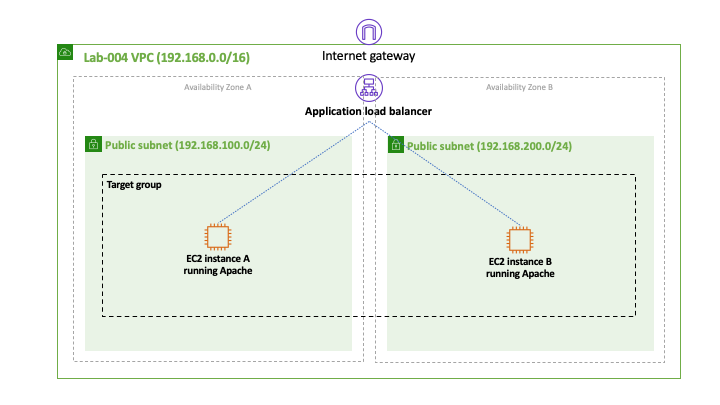
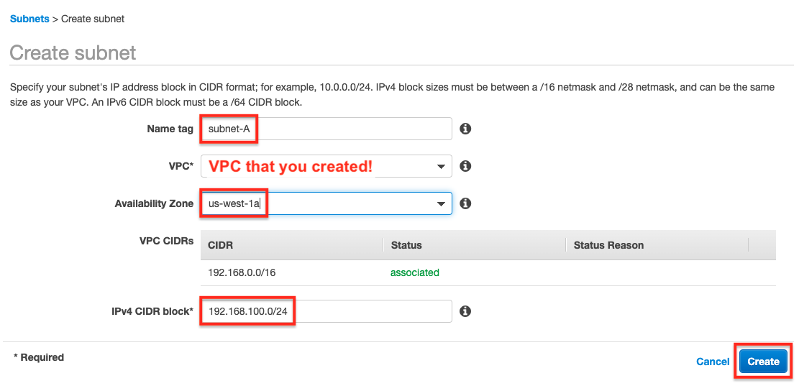
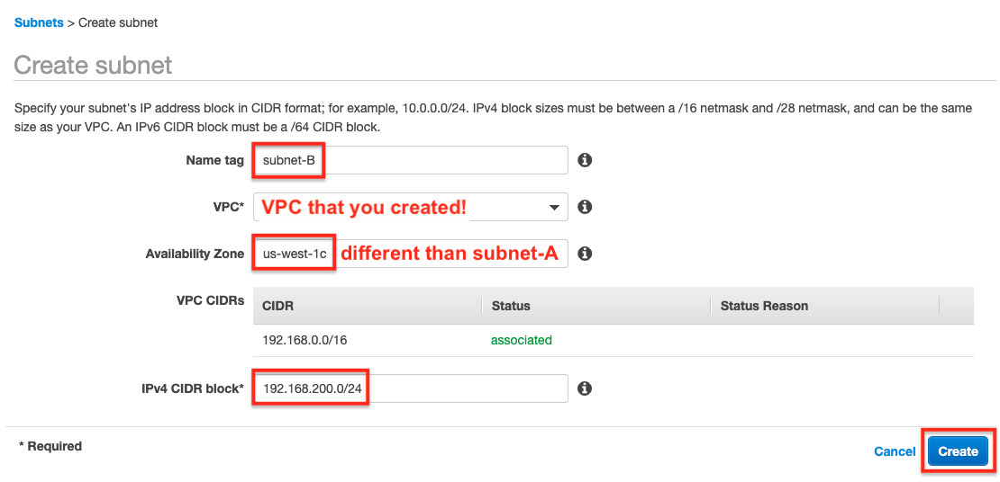
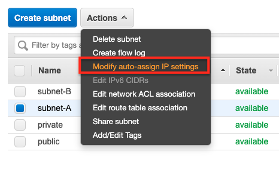
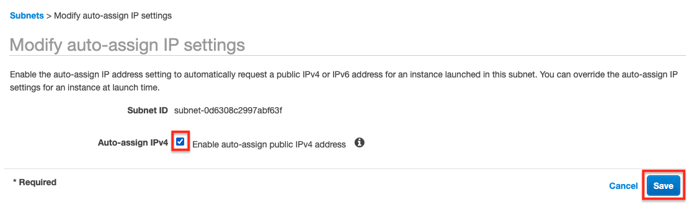

# Lab-005

## An HTTP Load Balancer

Difficulty Level: 1

Creation Date: June 11, 2020

Original Author(s): [Thyago Mota](https://github.com/thyagomota)

Contributor(s): [João Marcelo](https://github.com/jmhal)

## Goal
The goal of this lab is to illustrate how to use an [Application Load Balancer](https://docs.aws.amazon.com/elasticloadbalancing/latest/application/application-load-balancers.html) to distribute requests over two web servers running on distinct Availability Zones.

## Architecture Diagram

## Overview
AWS Elastic Load Balancing (ELB) service supports three types of load balancers:
* Application Load Balancer,
* Network Load Balancer, and
* Classic Load Balancer.

As the name suggests, the *Application Load Balancer* works at the application layer and understands protocols such as HTTP. This gives the load balancer the ability to support routing rules based on the URL or the host field in the HTTP header, for example.

### Step 1 - Create VPC and Subnets
Create a new VPC with the *Name tag* lab-005 and the *IPv4 CIDR block* 192.168.0.0/16. Then create two public subnets in distinct availability zones of your VPC.  Make sure to set the CIDR IPv4 block correctly to each subnet according to the ranges specified in the architecture diagram. You can use tags subnet-A and subnet-B for the subnets.

## Test and Validation
Provide some guidance on how to test the lab and validate whether it is doing what is suppose to do.
