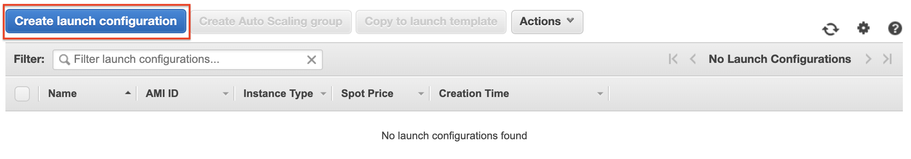
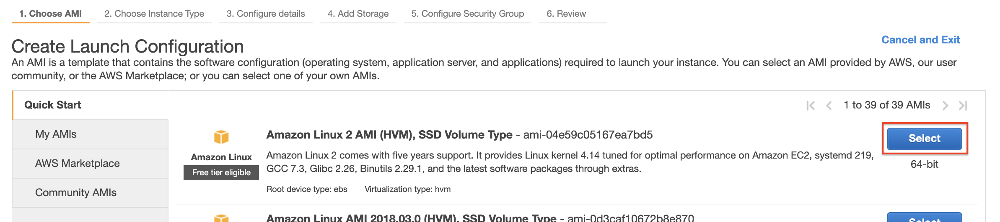
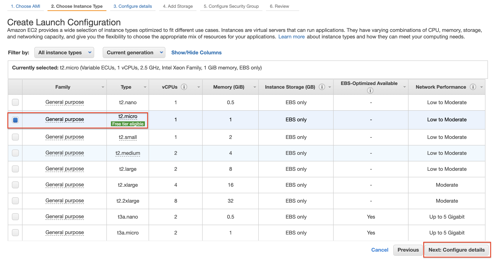
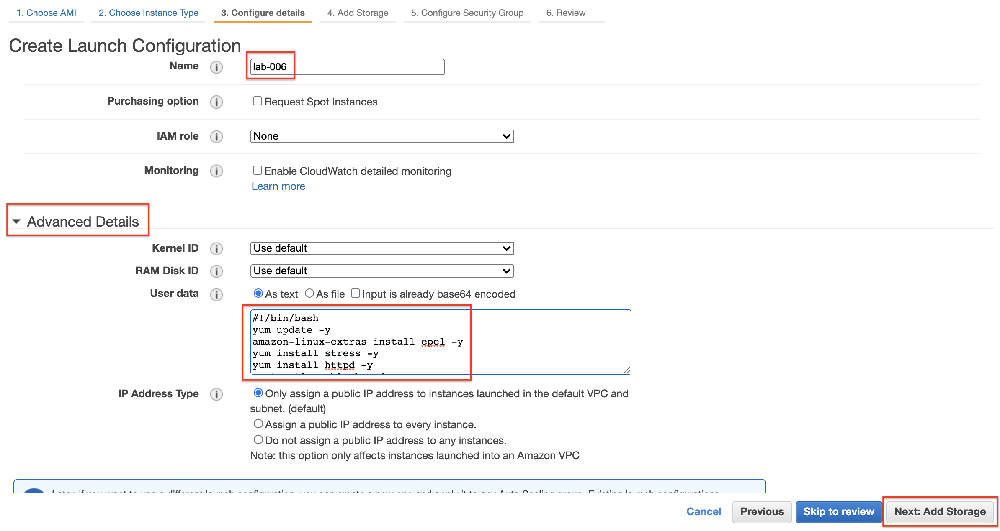
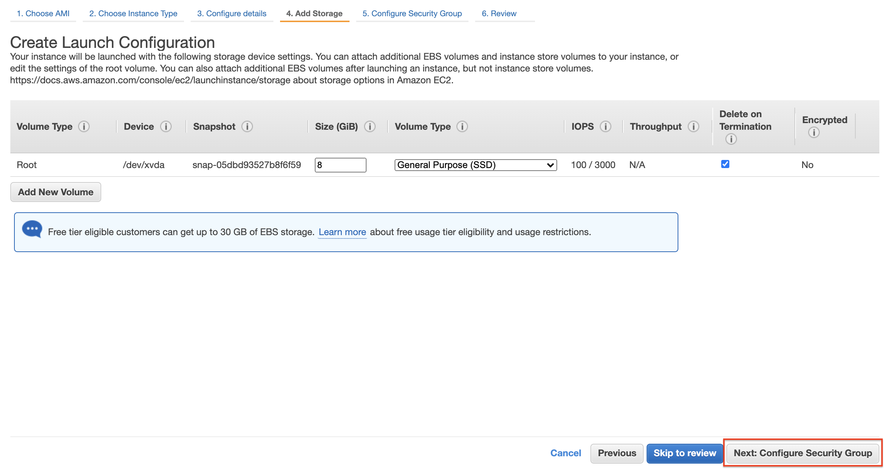
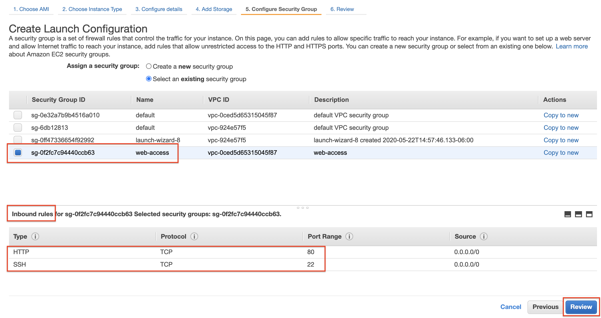
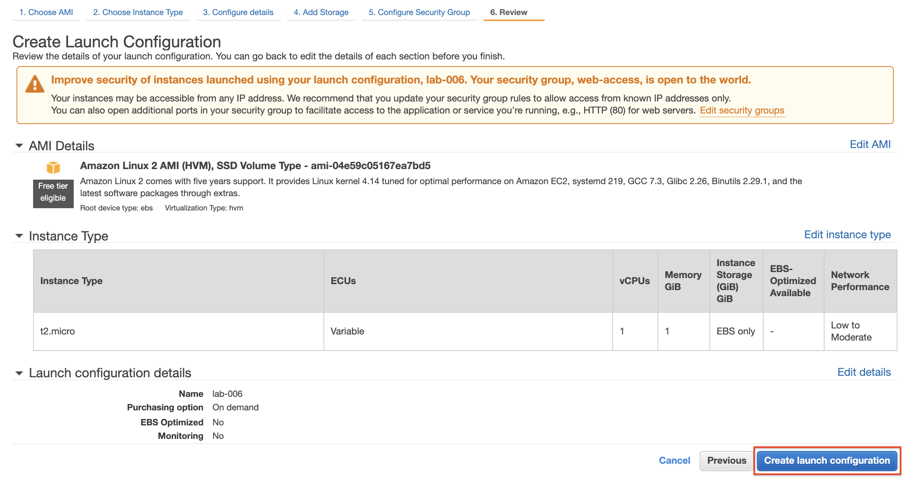
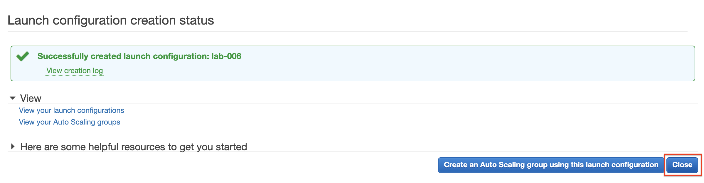

# Lab-006

## Simple EC2 Auto Scaling

Difficulty Level: 1

Creation Date: June 14, 2020

Original Author(s): [Thyago Mota](https://github.com/thyagomota)

Contributor(s): [João Marcelo](https://github.com/jmhal)

## Goal
This lab goal is to illustrate how to setup a simple EC2 auto scaling service. You will create an auto scaling group with initially only one EC2 instance running. But you will create a rule that will automatically launch a second EC2 instance when the CPU usage of the first instance reaches 75%.

## Architecture Diagram

## Overview
The EC2 Auto Scaling service enables automatically launching EC2 instances based on pre-defined conditions. A common scenario for auto scaling is launching more instances to cope with a sudden demand increase, for example. Two concepts are key to understand how AWS auto scaling works:

* Launch Configurations: it allows creating EC2 configurations so the service knows what type of EC2 instance to create when needed; and
* Auto Scaling Groups: a logical group of EC2 instances controlled by the auto scaling service.

Begin this lab by running steps 1-3 of [lab-005](../lab-005), making sure to replace any references to lab-005 with lab-006. Then follow the steps described next.

### Step 1 - Create a Launch Configuration

Get the user data script [here](files/user-data.sh) which will install a stress tool and launch an Apache web server. 

## Test and Validation
Provide some guidance on how to test the lab and validate whether it is doing what is suppose to do.
