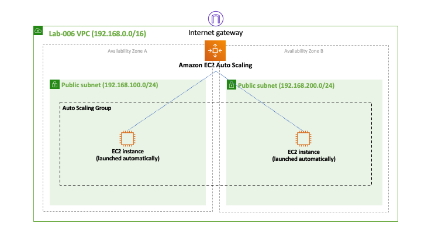

# Lab-006

## Simple EC2 Auto Scaling

Difficulty Level: 1

Creation Date: June 14, 2020

Original Author(s): [Thyago Mota](https://github.com/thyagomota)

Contributor(s): [João Marcelo](https://github.com/jmhal)

## Goal
This lab goal is to illustrate how to setup an EC2 auto scaling service. You will create an auto scaling group with initially only one EC2 instance running. But you will create a rule that will automatically launch a second EC2 instance when the CPU usage of the first instance reaches 75%.

## Architecture Diagram

## Overview
Write a short paragraph giving some background information about the services your lab will use. Reference the [AWS Documentation](https://docs.aws.amazon.com/index.html) or any other sources that you find online and deem valid.

Break this section into subsections explaining all steps needed to complete the lab. Use screenshots to create visual aids for readers that are new to AWS.

## Test and Validation
Provide some guidance on how to test the lab and validate whether it is doing what is suppose to do.
