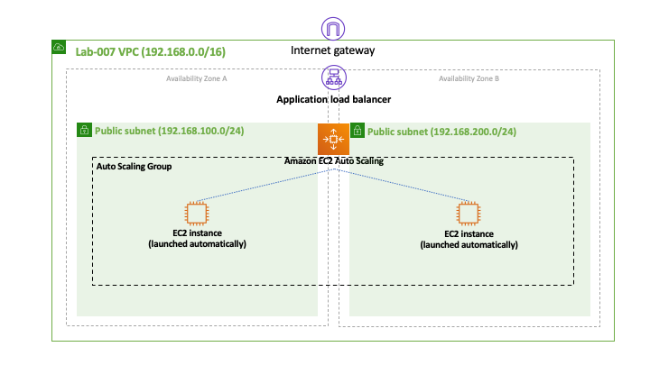
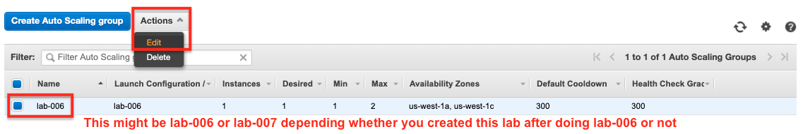
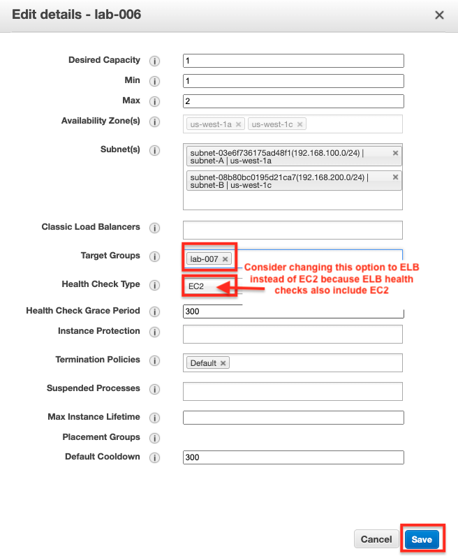

# Lab-007

## Simple EC2 Auto Scaling + Load Balancing

Difficulty Level: 1

Creation Date: June 14, 2020

Original Author(s): [Thyago Mota](https://github.com/thyagomota)

Contributor(s): [João Marcelo](https://github.com/jmhal)

## Goal
This lab is a continuation of [lab-006](../lab-006) with a Load Balancer added.

## Architecture Diagram


## Overview

### Step 1 - Create the Application Load Balancer

Follow [step 5 of lab-005](../lab-005), but do not add any targets to the load balancer target group.  

### Step 2 - Edit the Auto Scaling Group

Edit the auto scaling group adding the load balancer target group created in the previous step.



## Test and Validation
Copy the DNS name associated with the load balancer and, using a browser, try to access it. You should be able to see the response associated with the only EC2 instance that is running and automatically created by the auto scaling. Now connect to this instance through SSH and run the following commands to artificially increase CPU utilization.

```
stress -c 200
```
You can then begin monitoring the instance's CPU utilization increase and verify than when it reaches 75% or above a new EC2 instance will automatically be launched by the auto scaling service. After that, using the DNS associated with the load balancer, try to verify if you are able to see responses from both instances as you refresh the page. This test proves that the load balancer is working properly by redirecting the request evenly to the two instances.
