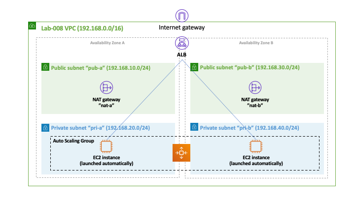

# Lab-008

## Secure EC2 Auto Scaling + Load Balancing

Difficulty Level: 2

Creation Date: June 15, 2020

Original Author(s): [Thyago Mota](https://github.com/thyagomota)

Contributor(s): [João Marcelo](https://github.com/jmhal)

## Goal
This is lab is similar to [lab-007](../lab-007) with a caveat: the auto scaling group is configured to create the EC2 instances in the private subnet. Also, two security groups control traffic in and out of the application load balancer and the EC2 instances in the private subnets. To enable the EC2 instances in the private subnet to respond to requests coming from the internet, NAT gateways were configured on the public subnets of the VPC.

## Architecture Diagram

### Step 1 - Create VPC, Subnets, and Internet Gateway

### Step 2 - Update Main Route Table and Configure Nat Gateways

### Step 3 - Create new Route Tables

### Step 4 - Configure Security Groups

### Step 5 - Configure Auto Scaling

### Step 6 - Configure the Application Load Balancer

## Test and Validation
Copy the public address of the load balancer and see if you can access the web server that is running on the EC2 instance that was auto-launched by the auto scaling service.

## Challenge
Modify this lab to use only one Nat gateway instead of two. Also, start the auto scaling group with two instances instead of only one.
