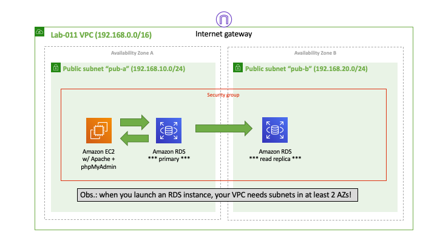
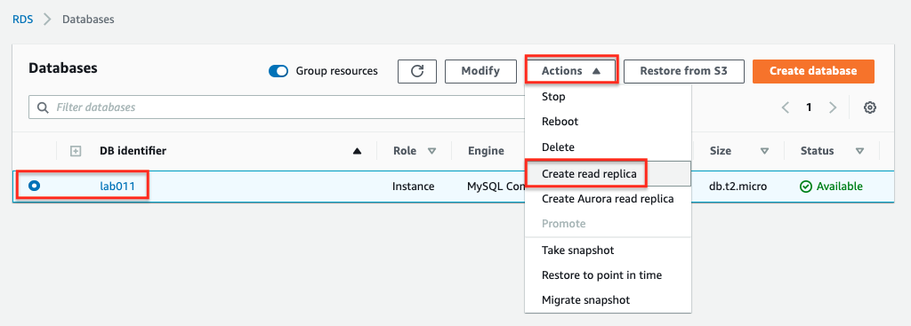
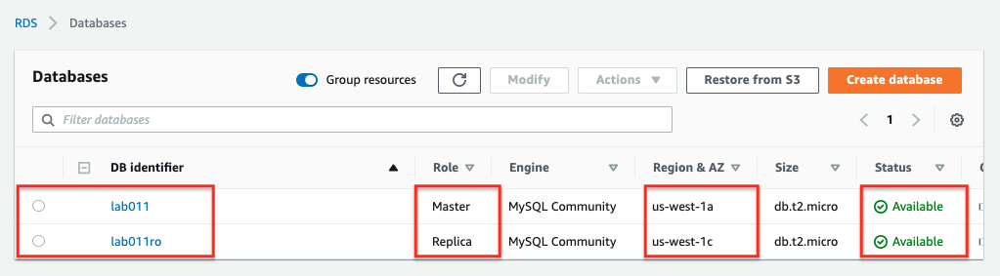
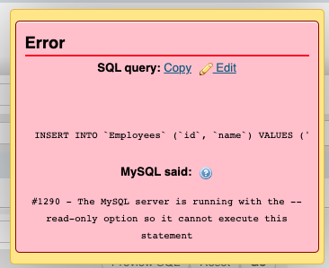

# Lab-011

## RDS Instance with a Read Replica

Difficulty Level: 2

Creation Date: June 22, 2020

Original Author(s): [Thyago Mota](https://github.com/thyagomota)

Contributor(s):

## Goal

This lab is similar to [lab-009](../lab-009) with the addition of a *read replica* RDS instance, a read-only copy of the database.

## Architecture Diagram

## Overview

Follow the steps described in [lab-009](../lab-009) with the following changes when creating the RDS instance:

* Templates: Dev/Test (free-tier won't work this time)
* DB instance identifier: lab011
* DB instance size: select *Burstable classes* and pick the *db.t2.small*
* Connectivity: set your custom VPC to be the one where your RDS instance will run; in the additional connectivity configuration - VPC security group, choose *Create new* and name it *lab011sg*; finally for the availability zone choose the one suffixed with 1a (or the first option that appears to you)
* Additional configurations: set the initial database name to *lab011* and make sure *automatic backups* is enabled.

### Step 1 - Create Read Replica

Select *Actions - Create read replica*.

Create the replica in a different AZ. Also, have it in the same security group *lab011sg*. For the *DB instance identifier* choose the name *lab011ro*. After a few minutes you should be able to see your *read replica* instance created.

## Test and Validation

Have the phpMyAdmin configuration to first connect to the primary (master) database instance. Create a table (or modify and existing one). You should be able to do it.

Then try to connect to the read replica instead.  Note that the read replica cluster has a different endpoint. You should be able to see the table modification that you did previously. Now try to *modify* the database (create a table or modify an existing one). You should not be able to do that now as the database is running in read-only mode.

