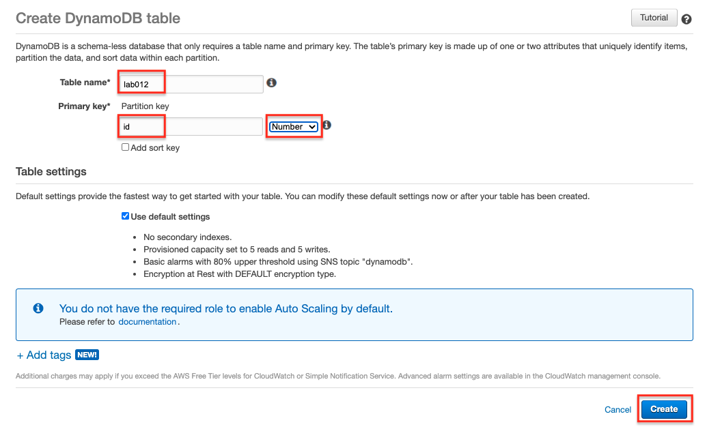
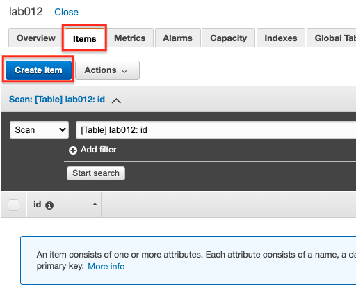
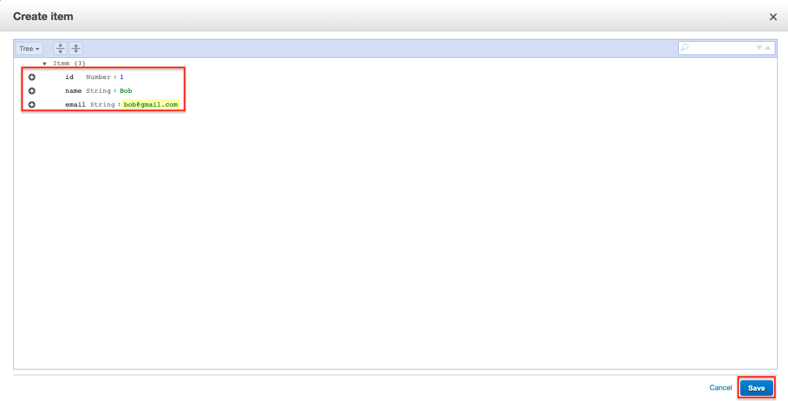
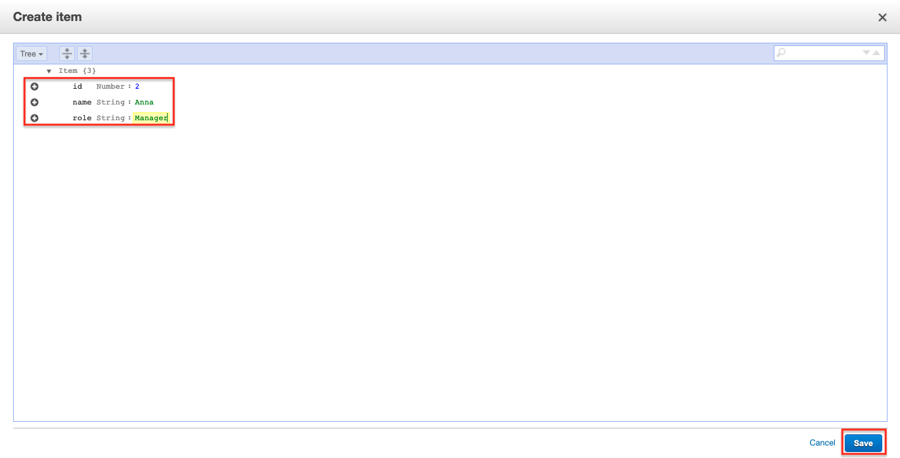
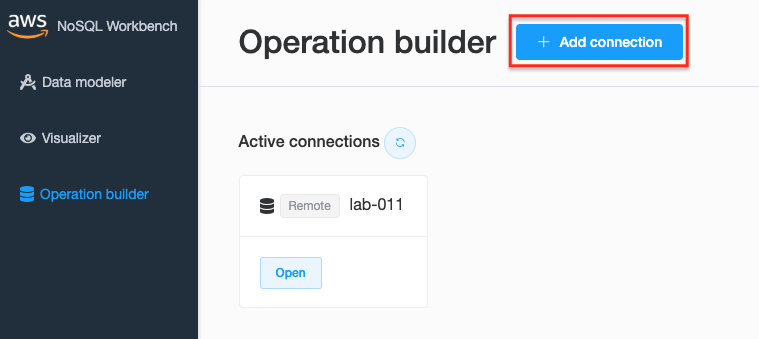
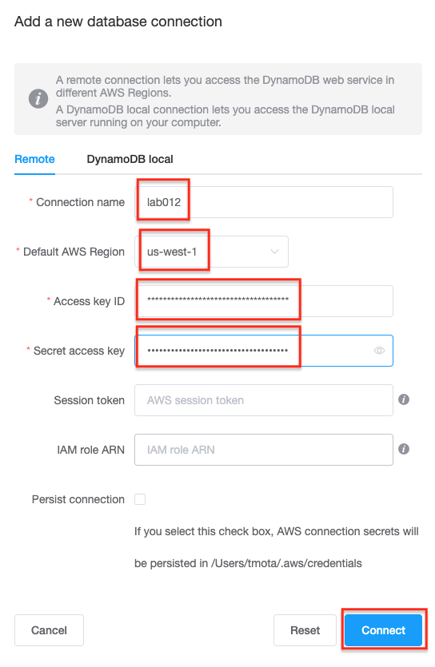
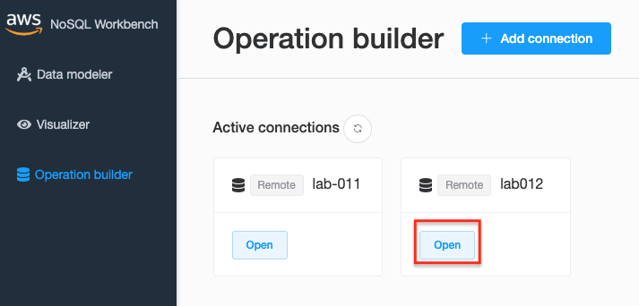
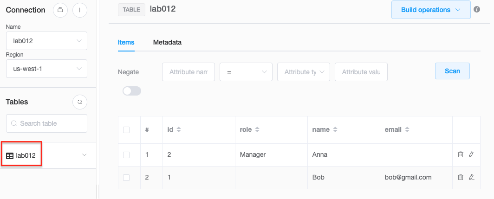
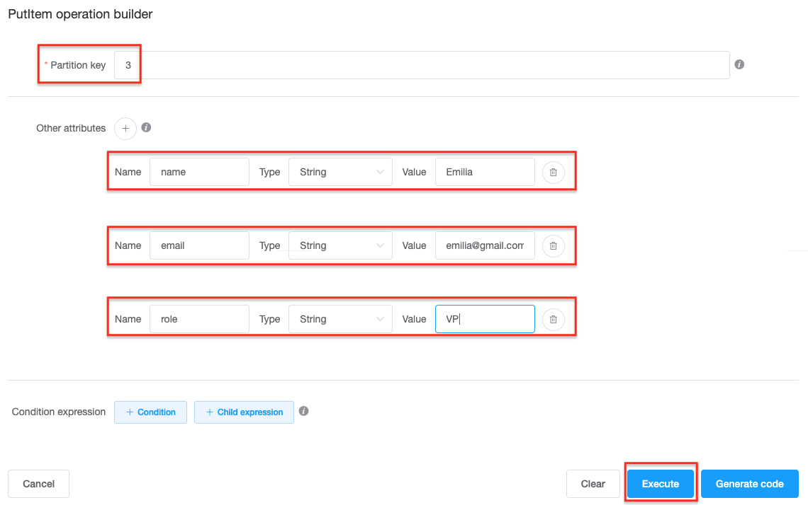

# Lab-012

## A Simple Dynamodb Service

Difficulty Level: 1

Creation Date: June 22, 2020

Original Author(s): [Thyago Mota](https://github.com/thyagomota)

Contributor(s):

## Goal

This lab illustrates how to create and remotely access a dynamodb table.  Dynamodb is a NoSQL managed database service.   

## Overview

### Step 1 - Create a Dynamodb Table

Go to Database - Dynamodb service and click on *Create table*.  

### Step 2 - Create and Download an Access Key

Go to IAM - Users and then select your user. Then go to *Security credentials* and create an access key. Download the key you created (a csv file) and use it on the next step.

### Step 3 - Connect to Dynamodb Table

Download and install [NoSQL Workbench](https://docs.aws.amazon.com/amazondynamodb/latest/developerguide/workbench.settingup.html).  Follow the steps to connect to your dynamodb table.

## Test and Validation

After you connect, try to visualize the contents of the table and modify it.

