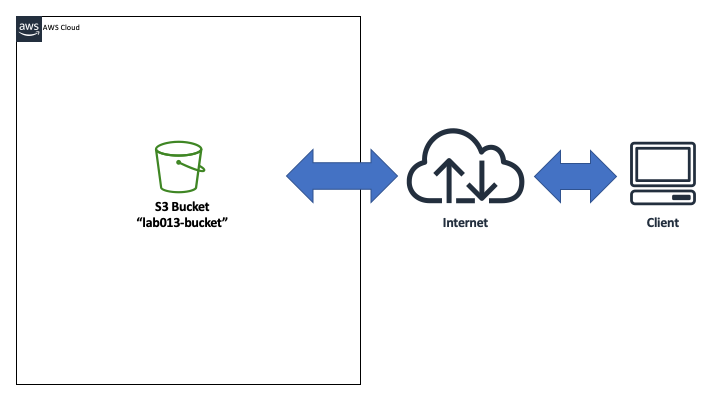
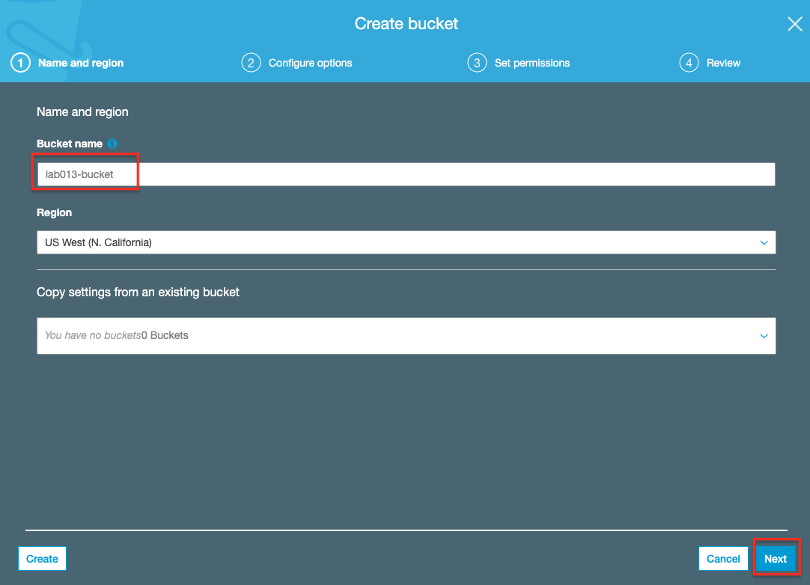

# Lab-013

## S3 Bucket Access via AWS CLI

Difficulty Level: 1

Creation Date: June 23, 2020

Original Author(s): [Thyago Mota](https://github.com/thyagomota)

Contributor(s):

## Goal
The goal of this lab is to illustrate how to create an S3 bucket and access it from a client computer via AWS CLI (command-line interface).

## Architecture Diagram



## Overview
Amazon S3 (Simple Storage Service) is an object-based storage service. An object is a file with attributes like name, value, access control info, etc. Access to objects in S3 is done through an API. Amazon S3 use containers called buckets to store objects. Bucket names are globally unique.

### Step 1 - Create an S3 Bucket

After naming your bucket you can accept all of the default options.




### Step 2 - Download and Install AWS CLI

Available [here](https://docs.aws.amazon.com/cli/latest/userguide/install-cliv2.html).

### Step 3 - Create and Download an Access Key

Go to IAM - Users and then select your user. Then go to Security credentials and create an access key. Download the key you created (a csv file) and use it on the next step.

### Step 4 - Configure AWS CLI

Open a terminal and configure your access key and default region on AWS CLI using:

```
aws configure
```

When prompted, enter your access key ID, access key secrete, and region (short) name.  

## Test and Validation
Open a terminal window and create a folder called *lab-013*. Then copy a few files to that folder.

First list all of your buckets using:

```
aws s3 ls
```

If you want to list the objects (and folders) of your *lab013-bucket* bucket try:

```
aws s3 ls s3://lab013-bucket
```

Try uploading some files using:

```
aws s3 cp file1.txt s3://lab013-bucket
```

To illustrate downloading a file you can try:

```
aws s3 cp s3://lab013-bucket/file1.txt file1-copied-back.txt
```
