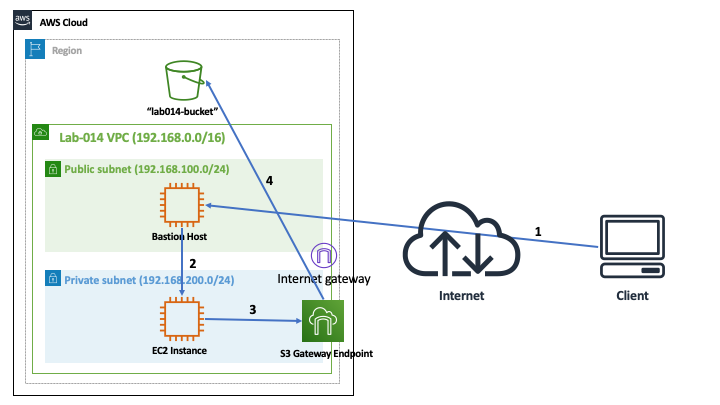
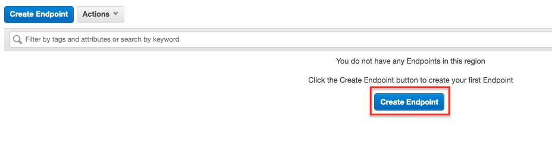
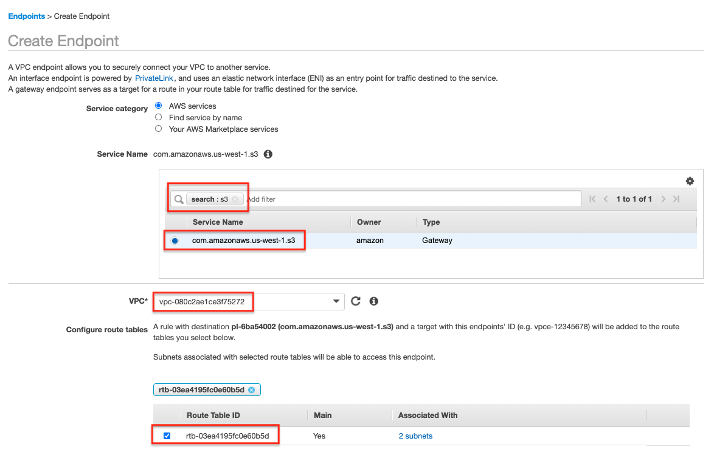
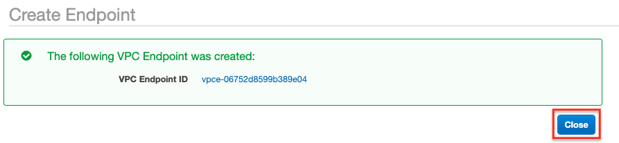

# Lab-014

## S3 Bucket Accessed via an S3 Gateway Endpoint

Difficulty Level: 2

Creation Date: June 23, 2020

Original Author(s): [Thyago Mota](https://github.com/thyagomota)

Contributor(s):

## Goal
The goal of this lab is to illustrate how to access an S3 bucket from an EC2 instance in a private subnet using an S3 gateway endpoint.

## Architecture Diagram



## Overview
The architecture diagram illustrates the steps we will have to take to demonstrate how the EC2 instance in the private subnet can still access an S3 bucket even if the instance does not have access to the internet.

1. From the client you can connect to a bastion host configured in the public subnet (see [lab-002](../lab-002)),
2. From the bastion host you can then connect to the EC2 instance in the private subnet,
3. From the EC2 instance you can use the S3 gateway endpoint, to ...
4. Access the S3 bucket.  

### Step 1 - Initial Setup

Follow the steps described in [lab-002](../lab-002), making sure you change all references to lab-002 with lab-014.

### Step 2 - Create an S3 Bucket

Name your S3 bucket *lab014-bucket*. Refer to [lab-013](../lab-013) if not sure how to do this step.   

### Step 3 - Create an S3 Gateway Endpoint

Go to VPC - Endpoints and click on *Create Endpoint*.






## Test and Validation
Connect to the EC2 instance in the private subnet. Configure AWS CLI with an access key. Create some test files. Then follow a test procedure similar to the one described in [lab-013](../lab-013).

First list all of your buckets using:

```
aws s3 ls
```

If you want to list the objects (and folders) of your *lab013-bucket* bucket try:

```
aws s3 ls s3://lab013-bucket
```

Try uploading some files using:

```
aws s3 cp file1.txt s3://lab013-bucket
```

To illustrate downloading a file you can try:

```
aws s3 cp s3://lab013-bucket/file1.txt file1-copied-back.txt
```
