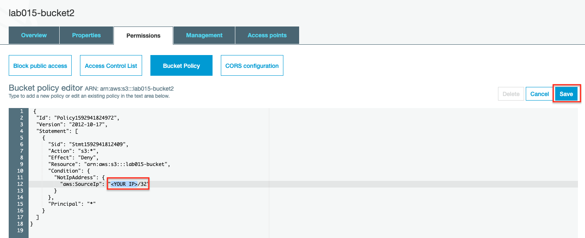

# Lab-015

## An S3 Bucket Accessed via AWS CLI + Resource Policy

Difficulty Level: 1

Creation Date: June 23, 2020

Original Author(s): [Thyago Mota](https://github.com/thyagomota)

Contributor(s):

## Goal
This lab is similar to [lab-013](../lab-013). However, instead of using a user access key to grant access from the client computer we will be setting a resource policy based on the client computer's source IP.  

## Overview

Repeat steps 1 and 2 of [lab-013](../lab-013), changing the name of the bucket to *lab015-bucket*.

### Step 1 - Create a Resource Policy

Because the policy we want to create is based on the IP of the computer we will be using to access the s3 bucket, use [whatismyip.com](https://www.whatismyip.com/) to determine what is your computer's current IP.

An easy way to create a policy is to use the [AWS Policy Generator](https://awspolicygen.s3.amazonaws.com/policygen.html) tool.  Use this [policy](files/policy.json) as an example. Don't forget to replace <YOUR IP> with your client computer's IP address.

### Step 2 - Apply Policy to Bucket



## Test and Validation

Verify that with the policy you are able to have full access to the s3 bucket. Try removing the policy and make sure that the access is denied after that.

In order to be able to regain access to the bucket you need to use the root credential to remove the policy.  Use the following command:

```
aws s3api delete-bucket-policy --bucket lab015-bucket
```
