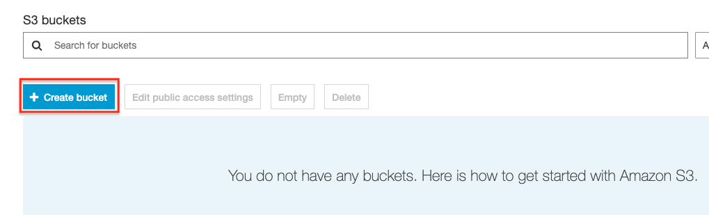

# Lab-015

## S3 Bucket Accessed via AWS CLI

Difficulty Level: 1

Creation Date: June 23, 2020

Original Author(s): [Thyago Mota](https://github.com/thyagomota)

Contributor(s):

## Goal
This lab is similar to [lab-013](../lab-013). However, instead of using a user access key we will be allowing access to the s3 bucket based on a resource policy that enables access from a computer based on its source IP.  

## Overview

Repeat steps 1 and 2 of [lab-013](../lab-013), changing the name of the bucket to *lab015-bucket*.

### Step 1 - Create a Resource Policy

Because the policy we want to create is based on the IP of the computer we will be using to access the s3 bucket, use [whatismyip.com](https://www.whatismyip.com/) to determine what is your computer's current IP.

An easy way to create a policy is to use the [AWS Policy Generator](https://awspolicygen.s3.amazonaws.com/policygen.html) tool.  Use the following parameters:

* Type of policy: *S3 Bucket Policy*
* Statement - Effect: Allow
* Statement - Principal: *
* Statement - Actions: mark *All Actions*
* Statement - Amazon Resource Name (ARN): arn:aws:s3:::lab015-bucket
* Statement - Add Condition: *IpAddress* (condition), *aws:SourceIp* (key), <your IP>/32 (value)


### Step 1 - Create an S3 Bucket

After naming your bucket you can accept all of the default options.




### Step 2 - Download and Install AWS CLI

Available [here](https://docs.aws.amazon.com/cli/latest/userguide/install-cliv2.html).

### Step 3 - Create and Download an Access Key

Go to IAM - Users and then select your user. Then go to Security credentials and create an access key. Download the key you created (a csv file) and use it on the next step.

### Step 4 - Configure AWS CLI

Open a terminal and configure your access key and default region on AWS CLI using:

```
aws configure
```

When prompted, enter your access key ID, access key secrete, and region (short) name.  

## Test and Validation
Open a terminal window and create a folder called *lab-013*. Then copy a few files to that folder.

First list all of your buckets using:

```
aws s3 ls
```

If you want to list the objects (and folders) of your *lab013-bucket* bucket try:

```
aws s3 ls s3://lab013-bucket
```

Try uploading some files using:

```
aws s3 cp file1.txt s3://lab013-bucket
```

To illustrate downloading a file you can try:

```
aws s3 cp s3://lab013-bucket/file1.txt file1-copied-back.txt
```
