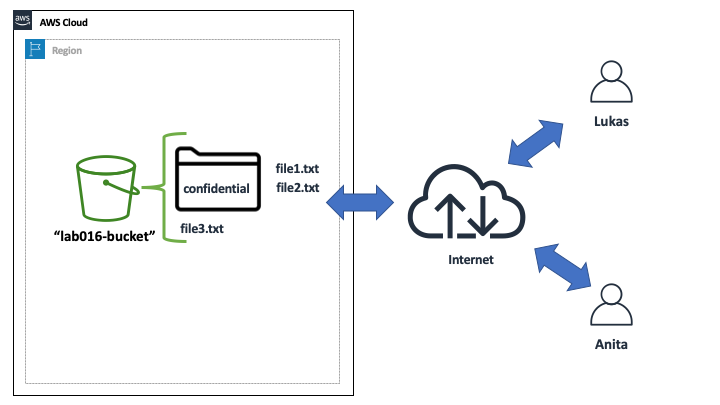
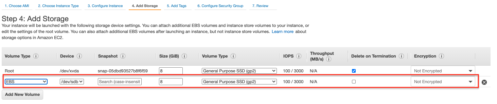
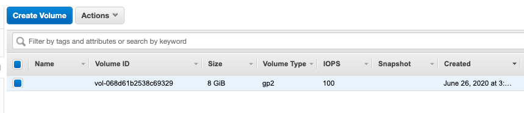
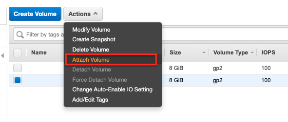
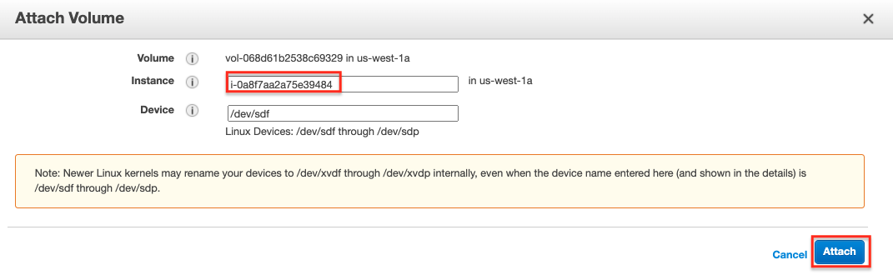

# Lab-016

## Moving an EBS Volume Between EC2 Instances

Difficulty Level: 1

Creation Date: June 26, 2020

Original Author(s): [Thyago Mota](https://github.com/thyagomota)

Contributor(s):

## Goal
The goal of this lab is to illustrate how to move an EBS volume from one EC2 instance to another.

## Architecture Diagram


## Overview

### Step 1 - Create an EBS Volume

During the *Add Storage* step of *Launch Instance*, add a new EBS volume.




### Step 2 - Mount EBS Volume

Connect to the EC2 instance via ssh and run *lsblk* to learn your EBS device's name. For example, the output I got from *lsblk* was:

```
NAME    MAJ:MIN RM SIZE RO TYPE MOUNTPOINT
xvda    202:0    0   8G  0 disk
└─xvda1 202:1    0   8G  0 part /
xvdb    202:16   0   8G  0 disk
```

The device */dev/xvda* is the boot volume, mounted at the root level. The device */dev/xvdb* must be the EBS volume that we created. Run the following commands to format and mount the disk:

```
sudo mkfs.ext4 /dev/xvdb
mkdir data
sudo mount /dev/xvdb data
```

Then use the following commands to create some files in your new disk:

```
sudo touch data/test1.txt
sudo touch data/test2.txt
sudo touch data/test3.txt
```

### Step 3 - Terminate the EC2 Instance

This step illustrates the fact that when you terminate an EC2 instance, non-boot volumes are not deleted by default. Go to *Elastic Block Store - Volumes* and verify that your EBS volume is still available even after the EC2 instance is terminated.



### Step 4 - Attach EBS Volume

Launch a new EC2 instance but this time do not create a new EBS volume. Instead, after your instance is launched, attach the EBS volume created earlier to the EC2 instance.




## Test and Validation

Connect to the new EC2 instance, mount the EBS volume and see if you can access the files created earlier.
