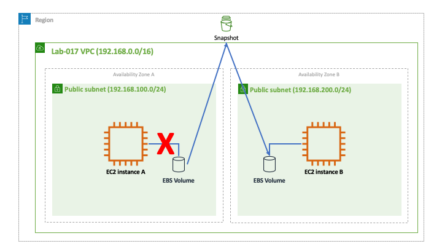
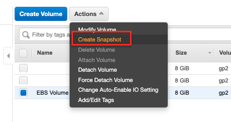
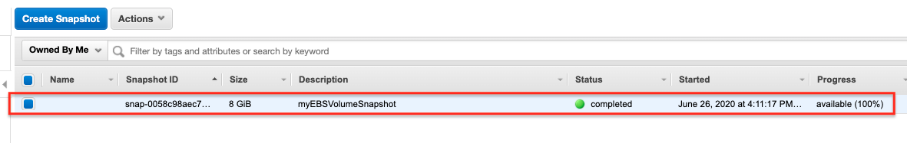
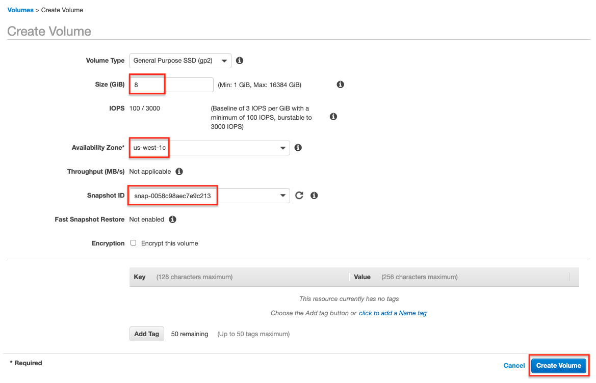

# Lab-017

## Snapshot an EBS Volume

Difficulty Level: 2

Creation Date: June 26, 2020

Original Author(s): [Thyago Mota](https://github.com/thyagomota)

Contributor(s):

## Goal
This lab's goal is similar to [lab-016](../lab-016) but because we want to move the volume to another AZ we will first create a snapshot of the volume.

## Architecture Diagram

## Overview

Create two EC2 instances in different AZs. Create an EBS volume and attach to one of them. Create some files in the volume and then terminate the the EC2 that had the attached volume. Then follow the steps.

### Step 1 - Create an Snapshot of an EBS Volume

Go to *Elastic Block Store - Snapshots*.

Then verify that your snapshot was created at *Snapshots*. You might want to copy the *Snapshot ID* to use it on the next step. Once your snapshot is created you can delete the EBS volume.

### Step 2 - Create an EBS Volume from a Snapshot

Create a new volume from the snapshot that you created in the previous step. Make sure your volume is created in the other AZ.

### Step 3 - Attach EBS Volume

Attach the EBS volume created from the snapshot to the EC2 instance running on the other AZ.

## Test and Validation

Connect to the EC2 instance running on the other AZ, mount the EBS volume and see if you can access the files created earlier.
